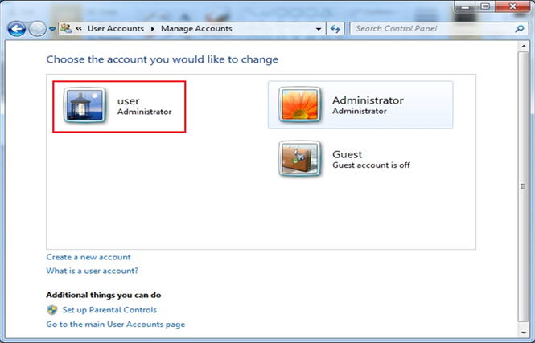
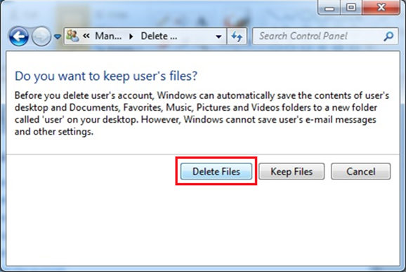

# Recovery CD user guide for WES7P
## 1. Recover system.
* **Touch Screen Calibration** : click five point Calibration
* **Recover OS** : install OS
* **Restart** : restart system
* **Command** : Partition the disk 
	*	diskpart
	*	list disk (check disk number)
	*	select disk x
	*	clean (erase all partition)
	*	cre part pri (create new primary patition)
	*	active (Set to bootable)
	*	assign (Assigns a drive letter)
	*	format quick fs=ntfs
	*	exit

## 2. Enable administrator account.
* **Start → all programs → Accessories → Command Prompt → run as administrator**

* **net user administrator /active:yes**

## 3. Login off then login to administrator and remove test account.
* **Start → control panel → Add or remove user accounts.**

* **Select test(user) account to delete .**

* **Delete the account → Delete Files → Delete Accounts.**

## 4. Install device driver. (Chipset, Graphic, Network, Audio, Others……)

## 5. Check Device Manager.
* **My computer → Manager → Device manager**

## 6. Reboot then back up OS. (ex.Ghost)
## 7. Use System Preparation Tool. (sysprep.exe)
* **open Recovery CD → run Sysprep_wes7_20170525.exe**

* **Select the current environment**

* **Computer system shutdown**

